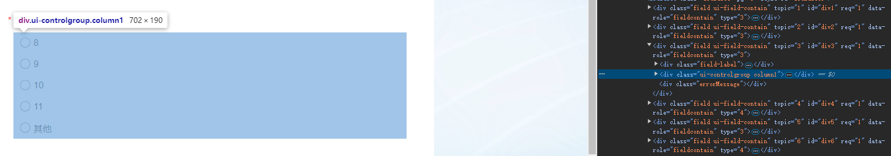
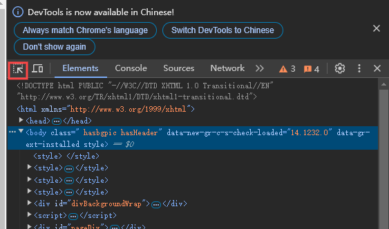

# 大学生社会实践版本答案――自动问卷机

一眼丁真（CyberTransporter）汉化组 @Jonathan_K_Wolf

## 目前适用于问卷星

还在为社会实践调查报告，（需要你收集到）一式几百份的问卷广到pyq但无人问津，而苦恼嘛？还在走投无路自己用手点到手麻而犯愁嘛？版本答案来辣！

## 使用前必看

0、本项目**仅供学习交流**、**研究**和**实践调查数据短缺应急使用**，**请勿用于商业用途**。

1、有问题issue留言，作者会尽量回复，但作者时间有限，可能无法及时回复，请谅解。

2、当前推出的“版本答案”――问卷机为1.0版本，功能如下：
- 根据问卷星网页链接和谷歌浏览器驱动实现网页端问卷星自动答题（选项随机）。可以设定为复数次重复执行问卷机代码，以实现问卷星问卷的批量填写。
- 目前版本暂时仅支持包含单选题、多选题和填空题的自动填写
- 加入了关于可能被问卷星系统判定为机器人的处理逻辑：当出现验证滑块时自动进行处理（功能实装但未验证，从使用到现在暂未出现被判定为机器人的情况，推测在执行次数过多的时候可能会出现，该功能若有问题请在issue及时反馈，或等待我们后续更新）
- 可根据选项的预期情况自动控制随机选项的范围（比如过于离谱的选项，或者是选择后出额外答题区的题目，可以根据你的需求设定为不选定）
  - 举个栗子：比如选项A.1 B.2 C.3 D.其他，但是当你选择D的时候你可能会发现，又弹出一个填空区，你如果不想触发这个填空，可以在代码中“人为控制”，具体见下面“教程”章节
- 填空题，可以设定一个你预设好的键值对字典，这样自动问卷机就可以从你的键值对中随机选择一个答案填写到答题框中，具体见下面“教程”章节

3、本项目基于python、谷歌浏览器及其内核，配置见“教程”

4、改进展望
- 提高代码可读性，进一步降低调试难度，争取做0基础小白友好型的代码调整机制；或是后面视情况可能直接更新成应用或前端网页，以便大家使用
- 添加更多复杂情况的支持：如排序题等更多扩展题型的自动补全、弹出选项的处理等（更多待大家issue补充）
- 制作自动问卷小程序扩展app（待定）
- ……

## 教程

### 1、准备工作

- （作者懒得写requirements.txt了）（bushi
- 推荐安装python3.8以上版本，低版本可能会出现兼容性问题
- 安装selenium、pyautogui
- 剩下的与包相关的问题，视报错情况而定自行pip/conda install基本都能解决
- 推荐使用谷歌浏览器，并且视实际谷歌浏览器路径**自行修改代码中的driver路径**
- 下载谷歌浏览器对应版本的谷歌驱动，具体可以到谷歌浏览器右上角--设置--关于chrome中，看到你谷歌浏览器的版本。如果找不到完全对应的版本就找与你谷歌版本最相近的驱动版本。同样需要在代码中**自行修改driver路径**

### 2、初步――几个需要视实际情况改动的代码接口

进入auto3_gai.py，找到以下几句代码，应该位于zonghe函数中：
```
url_survey = 'https://www.wjx.cn/vm/mWSd3ci.aspx'
option.binary_location = r'C:\Users\Administrator\AppData\Local\Google\Chrome\Application\chrome.exe'
service = Service(r"D:\Google\chromedriver-win64\chromedriver.exe")
```

第一个url_survey是你要自动填写的问卷链接

第二个option.binary_location是谷歌浏览器路径

第三个service是你下载的谷歌驱动的路径，在你谷歌驱动路径找到chromedriver.exe就是驱动，然后复制路径，粘贴到代码中即可

上面三个视你实际情况自行修改

PS：第一个url_survey是当前代码在我测试时，我自行制作的一份问卷的链接，你可以自行制作一份问卷，然后修改url_survey为你自己制作的问卷链接，或者是根据你所要进行自动要（shua）填（fen）写（shu）的问卷链接，修改之。关于问卷链接的获取，如果你得到的只是二维码也不用惊慌，使用手机端或者微信电脑端扫描二维码后你可以通过“使用浏览器打开”获取你问卷的链接。一般来说问卷星生成的问卷链接格式比较固定，比如：https://www.wjx.cn/vm/xxxx.aspx，其中xxxx部分就是你问卷的编号。


### 3、我发现，你的问卷我的问卷好像不一样？

别急！这是非常常见的情况，下面我将从个性化问卷的角度，教大家如何修改代码，以适应你的个性化问卷。

#### part1 handle_question函数

```
for answer in elements:
            if answer_type == 'radio':
                # 单选逻辑（保持不变）
                ans = answer.find_elements(By.CSS_SELECTOR, '.ui-radio')
                if exclude_other:
                    ans = [a for a in ans if "其他" not in a.find_element(By.CSS_SELECTOR, '.label').text]
                # 单选直接选择一个即可，无需循环
                if ans:
                    element = random.choice(ans)
                    wait = WebDriverWait(driver, 10)
                    wait.until(EC.element_to_be_clickable(element))
                    element.click()
```
如大家所见，这个部分就是处理单选的通用逻辑设置部分，在
```
if exclude_other:
    ans = [a for a in ans if "其他" not in a.find_element(By.CSS_SELECTOR, ' label').text]
```
中我们可以看到，如果问卷中存在“其他”选项，那么我们就会自动排除“其他”选项，因为该选项在问卷星的制作者制作过程中，这个部分往往是需要你手动填写的。如果你希望自动问卷机能够自动填写“其他”选项，那么你可以将exclude_other设置为False，
```python
def handle_question(driver, selector, answer_type='radio', valid_ans_count=1, exclude_other=True):# 把exclude_other=True改成exclude_other=False，如果你不希望排除“其他”
```
这样自动问卷机就会自动选择“其他”选项，然后自动填写“其他”选项的答案（这个部分见填空题）。当然我们现在，缺省默认的设置是求速度求方便，遇到这种可能需要额外填写的选项，自动问卷机会自动跳过该选项，直接选择处理下一个题目。

也就是说，如果你想要让问卷机能够同时覆盖所有选项，你就可以把exclude_other设置为False，如果你希望问卷机能够自动跳过“其他”或者其他你想跳过的选项（只需要把if中的"其他"换成别的关键字就可以），那么就设置为True。
```
else:  # checkbox 处理逻辑（重点修改此处）
                ans = answer.find_elements(By.CSS_SELECTOR, '.ui-checkbox')
                if exclude_other:
                    ans = [a for a in ans if "其他" not in a.find_element(By.CSS_SELECTOR, '.label').text]
                # 随机选择 1 到 valid_ans_count 个选项
                if ans:
                    num_to_select = random.randint(1, min(valid_ans_count, len(ans)))
                    available_ans = ans.copy()
                    random.shuffle(available_ans)
                    selected_ans = available_ans[:num_to_select]
                    for element in selected_ans:
                        wait = WebDriverWait(driver, 10)
                        wait.until(EC.element_to_be_clickable(element))
                        element.click()
                        # 点击后等待状态更新（可选：根据页面响应时间调整）
                        time.sleep(0.5)
```
这个部分用于处理多选，需要注意的第一个点就是注意你是否需要排除“其他”这类充数选项，避免选上之后还得自己填东西，很麻烦。第二个点就是valid_ans_count，这个参数用于控制多选题的选项数量，比如你希望问卷机能够随机选择2个选项，那么就设置为2，如果你希望问卷机能够随机选择3个选项，那么就设置为3，以此类推。当然，如果你希望问卷机能够随机选择所有选项，那么就设置为len(ans)，也就是多选题的选项总数。当然valid_ans_count我们一般不会在这里显式定义，一般是后面调用函数时视实际情况灵活定义。

#### part2 tiankong函数

```
def tiankong(driver, num):
    index = ["A", "B", "C", "D", "E"]
    answer = {"A": "无", "B": "好", "C": "good", "D": "我不留言你能奈我何", "E": "暂无"}
    try:
        input_element = driver.find_element(By.CSS_SELECTOR, f'#q{num}')
        input_element.send_keys(answer.get(index[random.randint(0, len(index) - 1)]))
    except NoSuchElementException:
        print(f"未找到第 {num} 题的填空题输入框。")
```

这个函数用于处理填空题，其中answer字典就是填空题的答案，你可以根据你的问卷自行修改，比如你希望问卷机能够随机选择“无”或者“好”作为答案，那么就修改answer字典为：
```python
answer = {"A": "无", "B": "好"}
```
当然，你也可以根据你的问卷自行修改answer字典，比如你希望问卷机能够随机选择“无”或者“好”或者“good”作为答案，那么就修改answer字典为：
```python
answer = {"A": "无", "B": "好", "C": "good"}
```
当然，如果你希望问卷机能够随机选择所有选项，那么就修改answer字典为：
```python
answer = {"A": "无", "B": "好", "C": "good", "D": "我不留言你能奈我何", "E": "暂无"}
```

值得注意的是，index和answer实际就是相当于问卷机，会在这个index-answer键值对中随机挑选一个作为填空题自动填写的答案，理论上说你可以设置任意数量的答案，并且修改答案的回答（是的你答对了，修改answer对应引号里面的文本就可以）保证你刷份数时答卷的灵活性hhh。

#### part3 renzheng与huakuai（认证与滑块）函数

这两个函数原本是用于处理认证和滑块验证码的，但目前我们在测试使用过程中并未出现类似的认证情况，如果后面出现了需要处理的情况而且代码报错的话还请大家issue留言，我们会根据遇到的问题在后续的更新版本中进行修改。

#### part4 其它需要改动的地方

```python
# 按顺序定义所有题目信息
        questions = [
            ('#div1 > div.ui-controlgroup.column1', 'radio', 1),
            ('#div2 > div.ui-controlgroup.column1', 'radio', 1),
            ('#div3 > div.ui-controlgroup.column1', 'radio', 1),
            ('#div4 > div.ui-controlgroup.column1', 'checkbox', 4),
            ('#div5 > div.ui-controlgroup.column1', 'radio', 1),
            ('#div6 > div.ui-controlgroup.column1', 'checkbox', 4),
            ('#div7 > div.ui-controlgroup.column1', 'checkbox', 5),
        ]
```
这个部分是需要大家到问卷星网页中使用F12（开发者模式），对网页控件进行控件检查得到的，我将讲述上面代码的含义。

**注意：上面questions代码仅针对你遇到的选择题**
```
('#div1 > div.ui-controlgroup.column1', 'radio', 1)
```
第一个引号的部分就是题目的id



看上面的截图。右侧网页源代码蓝色高亮的行即是题目的id，这个时候对着id点下右键-复制-复制selector，即可得到题目的id，然后把它按照题目顺序放到上面questions列表。

**等会等会，我有个问题**

这个时候大家肯定要问了，上面这个截图是怎么知道的呢？当你打开F12的时候，你看到的大概是这样的景色，



点击红色的框，然后把鼠标光标移动到左侧问卷星问卷中对应的位置，就可以显示出问卷对应控件的id了，这个时候当你的光标移动到题目上的时候，右面的网页源代码中蓝色高亮的行就是题目的id，这个时候你就可以复制下来，然后按照题目顺序放到上面questions列表中。

第二个引号，'radio'代表这是个单选题，'checkbox'代表这是个多选题，本来这个部分也是需要大家查id得到的，但目前问卷星的规律是单选题的id都是'radio'，多选题的id都是'checkbox'，所以这个部分我们就不需要大家去查id了，直接按照题目顺序放到上面questions列表中。

第三个引号，只需要改为本题目中有效选项数量就可以了，单选题默认是1，多选题的话，如果你不想让问卷机选到“其他”，那么把有效选项数量改成当前题目选项-1就可以了。

```python
# 处理填空题
        try:
            WebDriverWait(driver, 10).until(EC.presence_of_element_located((By.CSS_SELECTOR, f'#q8')))
            tiankong(driver, 8)
        except TimeoutException:
            print("未找到第8题的填空题元素，可能页面加载异常。")
```
这个位置是专门针对填空题的，有几道填空题就把这段代码copy几次就可以。注意的是，需要把所有涉及题号的地方改成你实际的题目号，比如你希望问卷机能够自动填写第9题的填空题，那么就把这里的**所有**8改成9，以此类推。

```python
gundong(driver, 1200)
```
这个是用于控制滚动幅度的函数，如果你的问卷过短或过长，按照实际情况控制后面数字的大小。

## 鸣谢

参考文献：
https://blog.csdn.net/m0_68174024/article/details/129598729?fromshare=blogdetail&sharetype=blogdetail&sharerId=129598729&sharerefer=PC&sharesource=weixin_52456426&sharefrom=from_link

## Join us

CyberTransporter团队欢迎各位大佬的加入，如果您有好的点子想要和我们一起实现，或者想要作一些技术或其它方面的交流，欢迎随时联系我们，邮箱：jonathankylechung@outlook.com